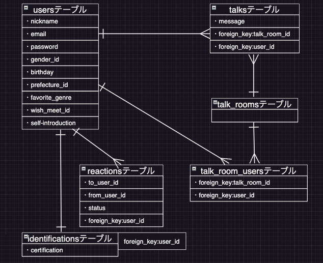
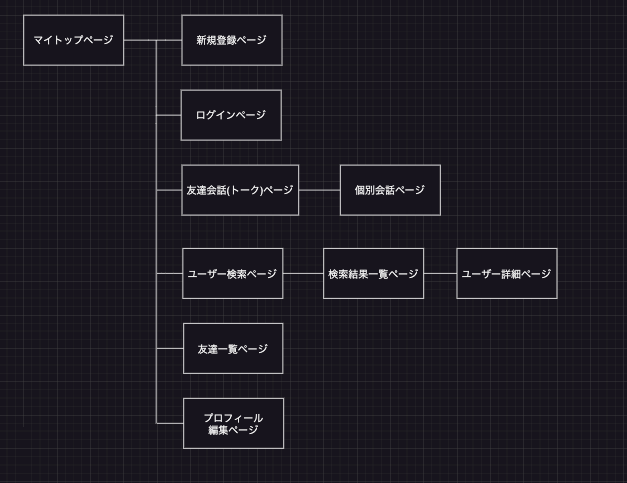

# アプリケーション名
 ウマREN  

# アプリケーション概要
 馬が好きな同士がメッセージを通して交流できるアプリ  

# URL
 https://umaren.onrender.com/  

# テスト用アカウント
 ・メールアドレス: suzuka@ura.jp  
 ・パスワード:umaren121  

# 利用方法
 交流したいユーザーを探す  
 1.トップページ(一覧ページ)のヘッダーからユーザー新規登録を行う  

 2.トップページ(一覧ページ)のヘッダーのユーザー検索をクリックし、その後交流したい相手の条件を入力、検索をすると条件に合ったユーザーが表示される  

 3.交流したいと思ったユーザーに対しいいねボタンを押し、その相手からもいいねボタンが押されると実際に会話をすることができる  

 4.会話画面はトップページ(一覧ページ)のヘッダーのトークボタンを押すと対象のユーザーの会話画面が表示される  

# アプリケーションを作成した背景
 同じ馬が好きな友人にヒアリングをし、「もっと馬のことで話せる友達が欲しい」という課題があがった、さらに深掘りをしてヒアリングをした結果、馬に絞った友達を作る場があまりないことが問題として判明し、「馬好き同士が交流できるプラットホームがないことが問題なのでは」と仮説を立てた。実際にホームページで検索したところ、馬に絞った交流サイトとして出ているものはなかった。この問題を解決するために、馬に特化した交流サイトを開発することにした。

# 洗い出した要件
 [要件を定義したシート](https://docs.google.com/spreadsheets/d/1L4lPZqUfL_vLcTrsLZ-L1PT7JLobcRvBaNrdXbjEseY/edit?usp=sharing)

# 実装した機能についての画像やGIFおよびその説明
 [トップページ](https://i.gyazo.com/b7053a76d422f037e08b53abfcce91ec.mp4)

 全てトップページから始まることができ、トーク、ユーザー検索、友達一覧、プロフィール編集と機能をまとめている。  

# 実装予定の機能
 現在ユーザー管理機能を実装中  
 今後はユーザー検索、いいね機能などの交流機能を実装していく予定  

# データベース設計

# 画面遷移図

# 開発環境
 ・Ruby  
 ・Ruby on Rails  
 ・MySQL  
 ・Github  
 ・render  
 ・Visual Studio Code  

# ローカルでの動作方法
 % git clone https://github.com/suzuka1621/umaren  
 % cd umaren  
 % bundle install  
 % yarn install  
 % rails db:create  
 % rails db:migrate  
 % rails s  

# 工夫したポイント
 開発をスムーズに進めるため、GitHubのProjects機能を使い、機能ごとに開発の区切りを計画し、その機能では何が必要かを記載し実装抜けがないようにした。